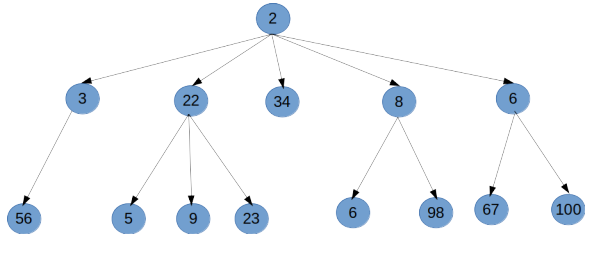
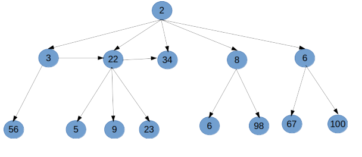
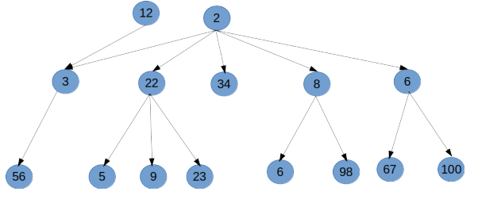
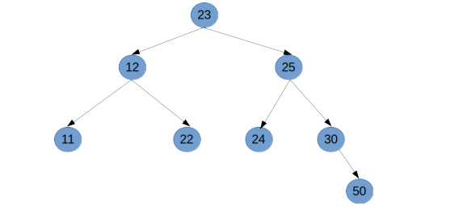

# Binary Search Trees

## Implemented with JavaScript

## **Introduction to trees**

A tree is a data structure that consists of nodes in a parent child relationship.



In the figure above, each circle represents a **node** in the tree, each node can have more than one child or zero children.

Trees a re non-linear data strucutures.

## **_Not a Tree_**


_Reason: a child can only point to a child, a child cannot point to a sibling_


_Reason: a tree can only have one root this one here has two roots_

## **_Terminologies Associated With A Tree_**

- **Root** - The top most node of a tree that has no parent.
- **Child** - A node directly connected to another when moving away from the tree in a bottom direction.
- **Parent** - converse notion of a child.
- **Siblings** - nodes with the same parent.
- **Leaf** - a node with no children.
- **Edge** - connection between nodes.

## **_Uses for trees_**

- HTML Document Object Model -> nesting of children elements in the DOM.
- Network routing.
- Abstract Syntax Tree -> Describing the syntax of a programming language using a tree.
- Artficial intelligence.
- Folders organistaion in an operating system.
- Computer files system.
- JSON.

# **_Binary Trees_**

This is a type of tree where each node can have at most 2 children.


# **_Binary Search Trees_**

It is similar to binary trees, however, it stores data that can be compared.

**All items that are less than the node are kept to the left of it and all items greater than the node are kept to the right of it.**


## **_Implementation of binary search tree_**

## **_the node class_**

```js
class Node {
  constructor(value) {
    this.value = value;
    this.left = null;
    this.right = null;
  }
}
```

## **_the binary search tree class_**

```js
class BinarySearchTree {
  constructor() {
    this.root = null;
  }
}
```

In BST or any other tree, we are interested with inserting, finding and traversing it.

## **_inserting_**

Creating a new node with our value and putting it in the right spot in our tree.

**Inserti steps**

1. Create a new node.
2. Starting at the root:
   - Check if there is no root, if there is no root, the new node becomes the root.
   - If there is a new node, check if the value of the new node is greater than or less than that of the root.
   - If greater:
     - Check to see if there is a node to the right.
     - If there is a node, move to that node and repeat the steps.
     - If there is not, add that node as the right property.
   - If less:
     - Check to see if there is a node to the left.
     - If there is, move to that node and repeat these steps.
     - If there is not, add that node as the left property.
3. You can return the entire tree.

**the code**

```js
insert(value) {
    let newNode = new Node(value);

    /*is there a root, if no, make this element the root*/
    if (this.root === null) {
      this.root = newNode;
      return this;
    }

    let current = this.root;
    /*update current as we go*/
    while (true) {
      if (value === current.value) return undefined;
      if (value < current.value) {
        /*go somewhere to the left*/
        /*is there anything or nothing in the left*/
        if (current.left === null) {
          /*nothing to the left*/
          /*insert here*/
          current.left = newNode;
          return this;
        } else {
          current = current.left;
        }
      } else if (value > current.value) {
        if (current.right === null) {
          current.right = newNode;
          return this;
        } else {
          current = current.right;
        }
      }
    }
}
```

## **_finding a node_**

As you've guessed, it's all about return true or false depending on whether the given value is in our tree or not.

**finding steps**

1. Check if there is a root, if there is not, return null.
2. If there is a root, check if the value of it is what we are lookin for, if it is we are done and no need to continue.
3. If not, check to see whether the value passed is greater than or less than that of the root.
4. If greater:
   - Check to see if there is a node to the right.
   - If there is, move to that node and repeat these steps.
   - If there is not, we are done searching.
5. If it is less:
   - Check to see if there is a node to the left.
   - If there is, move to that node and repeat these steps.
   - If there is not, we are done searching.

**the code**

```js
find(value) {
    if (this.root === null) return false;

    let current = this.root,
      found = false;

    while (current && !found) {
      if (value < current.value) {
        current = current.left;
      } else if (value > current.value) {
        current = current.right;
      } else {
        found = true;
      }
    }
    if (!found) return undefined;
    return current;
}
```

# **_Tree Traversal_**

This basically means visiting every node once.

There are two ways of traversing a tree:

- Breadth-first search -> _Horizontal_
- Depth-first search -> _Vertical_

We will use the tree below to do all the traversing


## **_Breadth First Search_**

Visit every node on the same level, i.e, visit every sibling node before looking at a child.

**BFS Steps**

1. Create a queue (this can be an array) and a variable to store the values of the nodes visited.
2. Place the root node in the queue.
3. Loop as long as there is anything in the queue.
   - Dequeue a node from the queue and push the value of the node into the variable that stores the values of the visited nodes.
   - If there is a left property on the node dequeued, add it to the queue.
   - If there is a right property on the node dequeued, add it to the queue
4. Return the variable that stores the values of the nodes visited.


```js
bfs() {
    /*does a breadth first traversal on the tree*/
    let data = [],
      queue = [],
      node = this.root;

    /*place the root node in the queue*/
    queue.push(node);

    /*loop as long as there is anything in the queue*/

    while (queue.length) {
      /*remove something from the beginning of the queue*/
      node = queue.shift();
      data.push(node.value);
      if (node.left) queue.push(node.left);
      if (node.right) queue.push(node.right);
    }
    console.log(data);
    return data;
}
```

_Expected output: [23, 12, 25, 11, 22, 24, 30, 50]_

## **_Depth First Search_**

It is furthere divided into three:

- **PreOrder**: visit the node, visit the entire left of it and then the entire right of it.
- **PostOrder**: visit the children of a node and then the node itself.
- **InOrder**: visit the left of a node, then the node itself and then the right of a node.

## **_PreOrder Traversal_**

Visit a node, then visit the entire left of a node and then the entire right of a node.

**PreOrder Steps**

1. Create a variable to store the values of the nodes visited.
2. Store the root of the BST in a variable called current or your preffered name.
3. Write a helper function that accepts a node:
   - Push the value of the node to the variable that stores the values of the nodes visited.
   - If the node has a left property, recursively call this helper function with the left property on the node.
   - If the node has a right property, recursively call the helper function with the right property on the node.
4. Invoke the helper function with the current variable or the root.
5. Return the array containing the values visited.


**the code**

```js
DFSPreorder() {
    let data = [],
      current = this.root;

    const traverse = (node) => {
      data.push(node.value);
      if (node.left) traverse(node.left);
      if (node.right) traverse(node.right);
    };
    traverse(current);
    console.log(data);
    return data;
}
```

_Expected output: [23, 12, 11, 22, 25, 24, 30, 50]_

## **_PostOrder Traversal_**

Visit all the children of a node then the node. i.e, you only visit a node after you have visited it's left and right.

**PostOrder Steps**

1. Create a variable to store the values of the nodes visited.
2. Store the root of the BST in a variable current.
3. Write a helper function which accpets a node:
   - If the node has a left property, call the helper function with the left property on the node.
   - If the node has a right property, call the helper function with the right property on the node.
   - Push the value of the node to the variable that stores the values visited.
4. Invoke the helper function with the current variable.


**the code**

```js
DFSPostOrder() {
    let data = [];
    const traverse = (node) => {
      if (node.left) traverse(node.left);
      if (node.right) traverse(node.right);
      data.push(node.value);
    };
    traverse(this.root);
    console.log(data);
    return data;
}
```

_Expected output: [11, 22, 12, 24, 50, 30, 25, 23]_

## **_InOrder Traversal_**

Visit the left of a node, then visit the node and finally visit the right of a node.

**When InOrder traversal is done correctly on a BST, the result is usually sorted in ascending order**


**InOrder Steps**

1. Create a variable to store the values of the nodes visited.
2. Store the root of the BST in a variable, you can call it current.
3. Write a helper function which accepts a node.
   - If the node has a left property, call the helper function with the left property on the node.
   - Push the value of the node onto the variable that stores the value of the nodes visited.
   - If the node has a right property, call the helper function with the right property on the node.
4. Invoke the helper function with the current variable.

**the code**

```js
DFSInOrder() {
    /*this method does an inorder traversal on the tree*/
    let data = [];
    const traverse = (node) => {
      if (node.left) traverse(node.left);
      data.push(node.value);
      if (node.right) traverse(node.right);
    };
    traverse(this.root);
    console.log(data);
    return data;
}
```

_Expected output: [11, 12, 22, 23, 24, 25, 30, 50]_

## **_Big O of BST_**

Insertion O(log n)

Searching O(log n)

## **_Where to use DFS vs BFS_**

Lots of nodes => DFS

Fewer nodes => BFS

InOrder traversal can be used to produces sorted results of values in a tree.

PreOrder traversal can be used to export a tree structure so that it can be easily reconstructed of copied.
